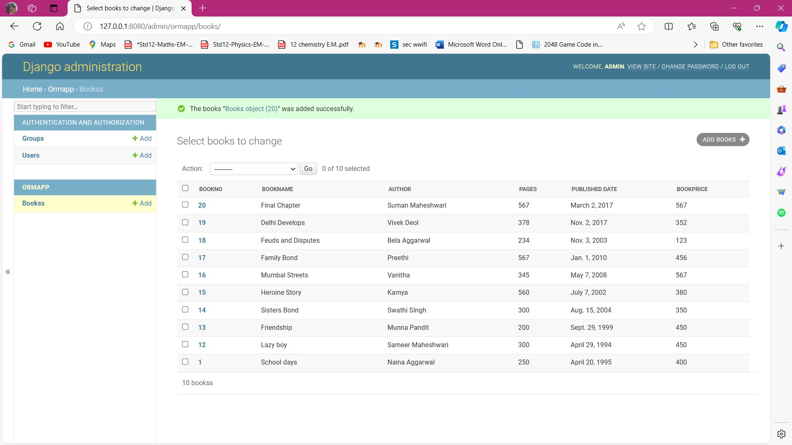
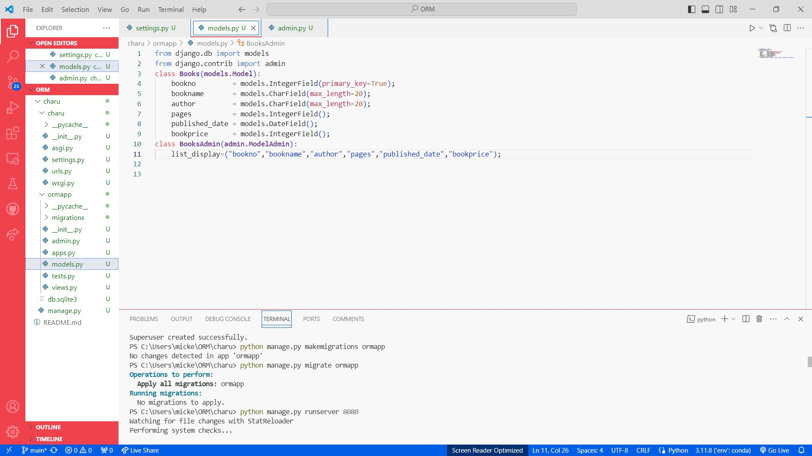

# Ex02 Django ORM Web Application
## Date: 

## AIM
To develop a Django application to store and retrieve data from a Book database using Object Relational Mapping(ORM).

## Entity Relationship Diagram

Include your ER diagram here

## DESIGN STEPS

### STEP 1:
Clone the problem from GitHub

### STEP 2:
Create a new app in Django project

### STEP 3:
Enter the code for admin.py and models.py

### STEP 4:
Execute Django admin and create details for 10 books

## PROGRAM
### models.py
```from django.db import models
from django.contrib import admin
class Books(models.Model):
	bookno         = models.IntegerField(primary_key=True);
	bookname       = models.CharField(max_length=20);
	author         = models.CharField(max_length=20);
	pages          = models.IntegerField();
	published_date = models.DateField();
	bookprice      = models.IntegerField();
class BooksAdmin(admin.ModelAdmin):
	list_display=("bookno","bookname","author","pages","published_date","bookprice");

```
### admin.py
```
from django.contrib import admin
from.models import Books,BooksAdmin
admin.site.register(Books,BooksAdmin)
```
## OUTPUT

 


## RESULT
Thus the program for creating a database using ORM hass been executed successfully
